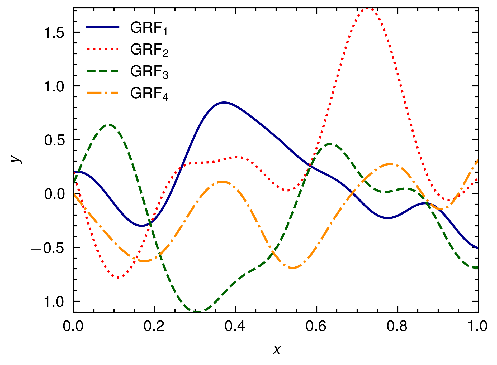
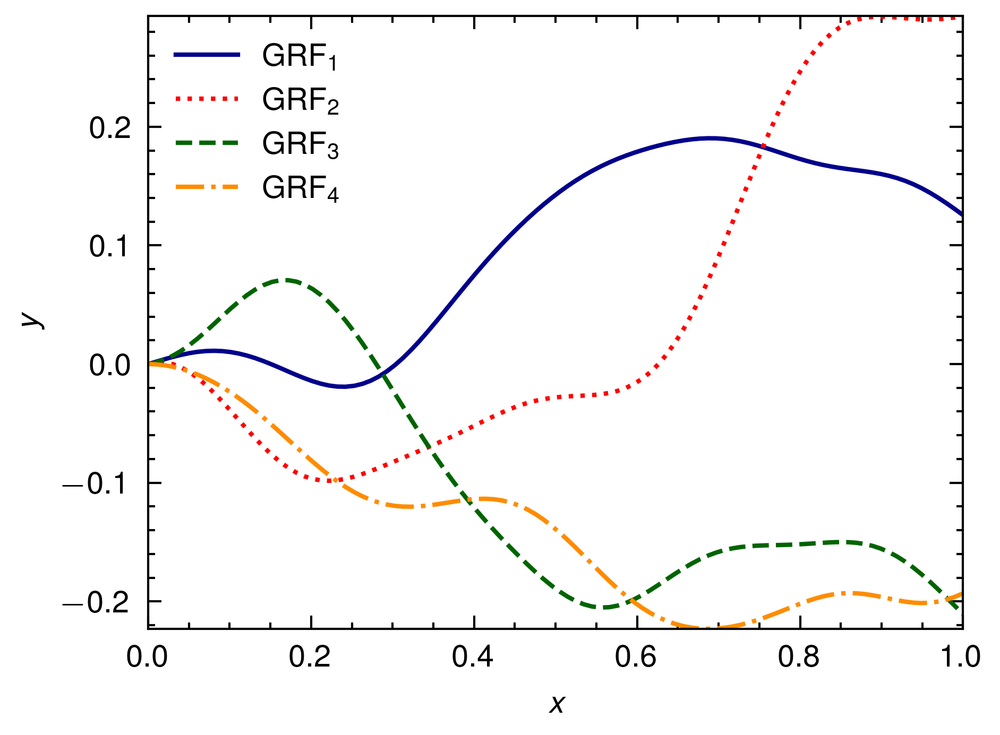

# DeepONet Tutorial

## Data

- Gaussian Random Field (GRF) for compact domain & compact range.
- GRFs are generated by [`rugfield`](https://github.com/Axect/Rugfield)
- For integral, the label for data is generated by integral of Cubic Hermite Splines.

